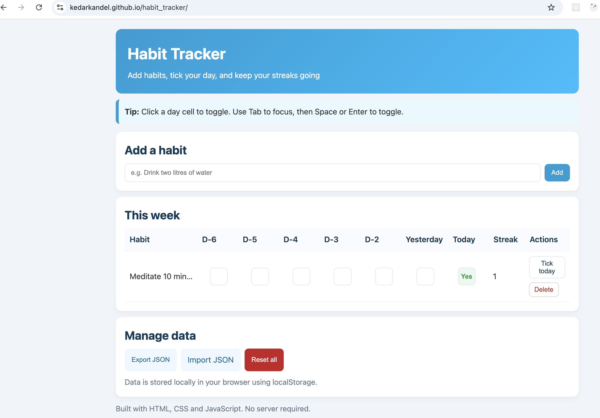

# Introduction
- This is a habit tracker application build using HTML5, CSS, and vanilla javascript. The application is designed and built with mobile first approach. It allows users to save habits and track whether they have been completed or not simply using a check mark toggle.

* Project setup
- clone the repository: git clone .....
- cd habit-tracker
- open with live server(index.html file)
- The app is runs on your default browser

* Fetures
- The application used local browser storage to save the data.
- User can add the todo task for a week
- Then the user can complete the task by using the checkbox toggle.
- the user can unchek or check back.
- user can delete the task as well.
- The app also counts the streaks/ counts on how many days the user has completed the task in a week.
- The user can import the list of task using a json file.
- similarly the user can export the todo lists.

* Here's a screenshot of the application:

* learning reflection

A key feature of the project was the implementationof unidirectional data flow which is store in a single state object. The application's architecture is planned and built on this principle the state variable is the complete source of truth. The app doesn't work if there is not state object. As can be seen in the code, every user interaction form adding a task to toggling, completing and delete follows a pattern. At first, the central state object is null. Once the data is pushed to the object, the application re-renders with the added data. The central objected is mutated in user interactions. Whether the new task is added or deleted or checked(completed), the application rerenders to display the current state. 
The state object is saved using browsers local storage. First we set the name of the storage and value and pull the value from the browwser using the anme if that exists. THis behavious helps to persist the data in the browser.

I have a beginnner level coding experience with frameworks like react and angular but this is really a foundation to understand the web. I had never written pure javascript code to build a website. It was a great opportunity to learn. It was challenging to set the valriables clarly at the beginning because i felt that variables declaration was missing at the beginning. To understand which particular task is clicked and track that was challenging for me. Even though i have used forEach and filter many times, this purest javascript code was challenging. It became clear to me that this is the foundation behind the various frameworks like React, Vue or Angular and I have now understood some of how those frameworks work behind the hood.
